# Human-in-the-Loop System - Main Architecture

This is the main architecture overview showing all major components and their relationships.

```mermaid
graph TB
    %% External Actors
    User[👤 Human User]
    Agent[🤖 SmolAgent]
    Admin[👨‍💼 Admin/Approver]
    
    %% Main System Entry Point
    API[🌐 FastAPI Application<br/>src/main.py<br/>- REST API endpoints<br/>- Application lifecycle<br/>- Dependency injection<br/>- CORS & middleware]
    
    %% Core Orchestration Layer
    Orchestrator[🎭 SmolAgent Orchestrator<br/>src/agents/orchestrator.py<br/>- Workflow execution<br/>- Agent integration<br/>- Tool management<br/>- Context enhancement]
    
    %% State Management Layer
    StateManager[📊 State Manager<br/>src/core/state_manager.py<br/>- Workflow state tracking<br/>- Event logging<br/>- Checkpoint creation<br/>- Rollback management]
    
    %% Approval System
    ApprovalEngine[✋ Approval Engine<br/>src/core/approval_engine.py<br/>- Approval request handling<br/>- Response validation<br/>- Multi-approver logic<br/>- Timeout management]
    
    %% Resilience & Recovery
    Resilience[🛡️ Resilience System<br/>src/core/resilience.py<br/>- Retry mechanisms<br/>- Circuit breakers<br/>- Timeout handling<br/>- Health monitoring]
    
    %% Multi-Channel Communication
    ChannelManager[📡 Channel Manager<br/>src/integrations/channels.py<br/>- Multi-channel notifications<br/>- Slack integration<br/>- Email handling<br/>- Webhook support]
    
    %% User Interface Layer
    UIRenderer[🎨 UI Renderer<br/>src/ui/approval_ui.py<br/>- Dynamic form generation<br/>- Multi-framework support<br/>- Schema-based rendering<br/>- Interactive components]
    
    %% Observability Layer
    Observability[📈 Observability Manager<br/>src/observability/monitoring.py<br/>- Prometheus metrics<br/>- OpenTelemetry tracing<br/>- Alert management<br/>- Performance monitoring]
    
    %% Data Layer
    Database[(🗄️ PostgreSQL Database<br/>- Workflow state<br/>- Approval requests<br/>- Event audit trail<br/>- Checkpoints)]
    
    %% External Integrations
    Slack[💬 Slack<br/>Interactive messages<br/>Approval buttons<br/>Commands & shortcuts]
    
    Email[📧 Email<br/>SendGrid/SMTP<br/>HTML templates<br/>Quick action links]
    
    Webhooks[🔗 Webhooks<br/>External systems<br/>Event notifications<br/>Custom integrations]
    
    Prometheus[📊 Prometheus<br/>Metrics collection<br/>Performance data<br/>System health]
    
    Jaeger[🔍 Jaeger<br/>Distributed tracing<br/>Request tracking<br/>Performance analysis]
    
    %% Tool Integration
    subgraph Tools[🔧 SmolAgent Tools]
        ApprovalTool[🤝 Approval Request Tool<br/>- Human approval requests<br/>- Context data passing<br/>- Timeout configuration]
        CheckpointTool[📍 Checkpoint Tool<br/>- State snapshots<br/>- Rollback points<br/>- Recovery markers]
        RollbackTool[⏪ Rollback Tool<br/>- State restoration<br/>- Checkpoint selection<br/>- Reason tracking]
    end
    
    %% Data Models
    subgraph Models[📋 Data Models<br/>src/models/workflow.py]
        WorkflowModel[Workflow<br/>- State tracking<br/>- Execution context<br/>- Metadata]
        ApprovalModel[Approval Request<br/>- Multi-channel config<br/>- UI schema<br/>- Validation rules]
        EventModel[Workflow Event<br/>- Audit trail<br/>- State transitions<br/>- Context capture]
        CheckpointModel[Checkpoint<br/>- State snapshots<br/>- Recovery data<br/>- Metadata]
    end
    
    %% Main Flow Connections
    User -->|API Requests| API
    Admin -->|Approvals| ChannelManager
    Agent -->|Executes via| Orchestrator
    
    API --> Orchestrator
    Orchestrator --> StateManager
    Orchestrator --> ApprovalEngine
    Orchestrator --> Resilience
    
    ApprovalEngine --> ChannelManager
    ApprovalEngine --> UIRenderer
    
    StateManager --> Database
    ApprovalEngine --> Database
    
    ChannelManager --> Slack
    ChannelManager --> Email  
    ChannelManager --> Webhooks
    
    Observability --> Prometheus
    Observability --> Jaeger
    
    %% Tool Connections
    Orchestrator --> Tools
    ApprovalTool --> ApprovalEngine
    CheckpointTool --> StateManager
    RollbackTool --> StateManager
    
    %% Model Connections  
    StateManager --> Models
    ApprovalEngine --> Models
    
    %% Monitoring Connections
    API -.->|Metrics| Observability
    Orchestrator -.->|Tracing| Observability
    StateManager -.->|Events| Observability
    ApprovalEngine -.->|Metrics| Observability
    
    %% Styling
    classDef primary fill:#e1f5fe,stroke:#01579b,stroke-width:2px
    classDef secondary fill:#f3e5f5,stroke:#4a148c,stroke-width:2px
    classDef data fill:#e8f5e8,stroke:#1b5e20,stroke-width:2px
    classDef external fill:#fff3e0,stroke:#e65100,stroke-width:2px
    classDef tools fill:#fce4ec,stroke:#880e4f,stroke-width:2px
    
    class API,Orchestrator,StateManager,ApprovalEngine primary
    class ChannelManager,UIRenderer,Resilience,Observability secondary
    class Database,Models data
    class Slack,Email,Webhooks,Prometheus,Jaeger external
    class Tools,ApprovalTool,CheckpointTool,RollbackTool tools
```

## Key Architecture Principles

### 🎯 **Event-Driven Design**
- All state changes generate events
- Asynchronous approval processing  
- Non-blocking workflow execution
- Complete audit trail maintenance

### 🔄 **State Management**
- PostgreSQL for persistent state
- Automatic checkpoint creation
- Complete rollback capabilities
- Event sourcing patterns

### 🌐 **Multi-Channel Communication**
- Slack interactive messages
- Rich HTML email templates
- Webhook integrations
- Dynamic UI generation

### 🛡️ **Resilience & Recovery**
- Circuit breaker patterns
- Configurable retry policies
- Timeout and escalation handling
- Automatic failure recovery

### 📊 **Comprehensive Observability**
- Prometheus metrics collection
- OpenTelemetry distributed tracing
- Real-time alerting system
- Performance monitoring